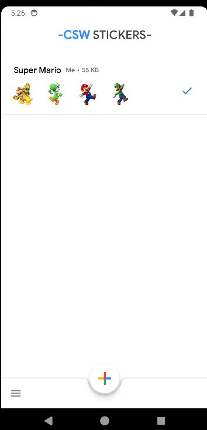

# Stickers creator for WhatsApp write in Kotlin
This is an app that can create stickers for whatsapp based on https://github.com/vidit135g/Sticker_Maker
This is an incomplete project, had a lot of code that isnt use and only can create Stickers pack, but cannot edit them

You are free to use it, only give credits to vidit135g

