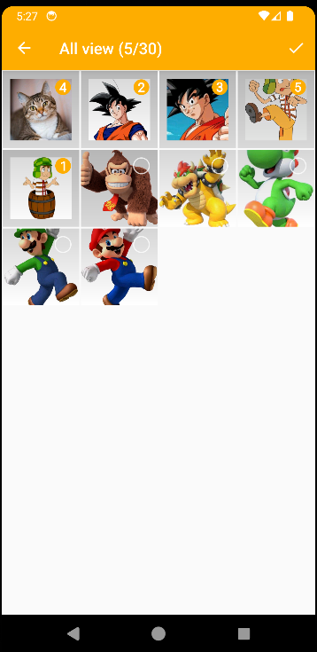

# Stickers creator for WhatsApp write in Kotlin
This is an app that can create stickers for whatsapp based on https://github.com/vidit135g/Sticker_Maker

This project is incomplete; it contains a lot of unused code and can only create sticker packs but cannot edit them.

You are free to use it, just make sure to give credits to vidit135g.

